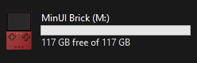
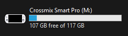

# TrimUI Custom Device Icons

Custom device icons for the TrimUI Brick (TG3040) that display when connecting the microSD card to a PC.




## Overview

This repository contains custom device icons for the TrimUI Brick & Smart Pro. When you insert your TrimUI Device's microSD card into a PC, these icons will make it easily identifiable in file explorer with a custom device icon instead of the default generic drive icon.

## Contents

- `Colour.ico` - Themed TrimUI device icon (32x32 to 256x256)
- `autorun.inf` - Configuration file for Windows icon display
- `Stock` - `.png` images of the devices

## Download
1. Navigate to [releases](https://github.com/RidJuan/TrimUIIcons/releases)
2. Download the latest release `.zip` file
3. Extract the `.zip` file

## Windows Installation

1. Navigate to `TrimUI Icons\Device\Colour` folder
2. Copy both the `.ico` file and `autorun.inf` from this folder to your device's microSD card root directory
3. Edit `autorun.inf` in your preferred text editor:

   ```ini
   [autorun]
   icon = Colour.ico
   label = MinUI Brick
   ```
   Note: Change `MinUI Brick` or `Crossmix Smart Pro` to your preferred display name for the microSD card

4. Save the `autorun.inf` file
5. When you reinsert the microSD card, it should now display the custom icon

## MacOS Installation

1. Go to the mounted drive on your desktop.
2. Highlight the drive and hit `CMD+I` to go to the Info menu
3. At the top where the icon is highlight it 
4. Navigate to `TrimUI Icons\Stock Files\`
5. Press `CMD+C` to copy the `Colour.png` file
6. Now on the Info menu icon, press `CMD+V`, which sets the new icon

## Compatibility

- MacOS
- Windows 11
- TrimUI Brick (TG3040)
- TrimUI Smart Pro (TG5040)

## Support

If you encounter any issues or have suggestions, please open an issue in this repository.
